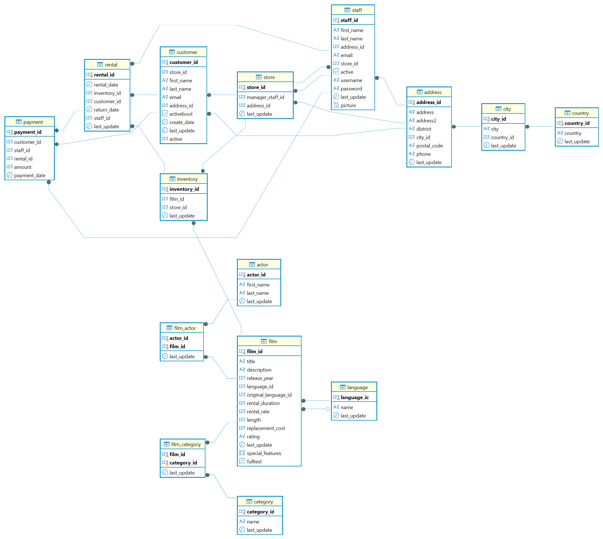

# 🎬 Consultas SQL sobre la base de datos Sakila

Resolución de las 64 consultas del DataProject "Lógica: Consultas de SQL" sobre **Sakila**, la base de
datos de ejemplo de una tienda de alquiler de películas, usando **PostgreSQL** y **DBeaver**.

## 📖 Descripción

El objetivo del proyecto es demostrar el manejo de SQL en sus distintos niveles: consultas sobre una
sola tabla, relaciones entre tablas con los distintos tipos de `JOIN`, subconsultas, vistas y
estructuras de datos temporales, aplicando buenas prácticas de escritura y, sobre todo,
**entendiendo el resultado que devuelve cada consulta**.

No se trata solo de que la consulta se ejecute sin error: varias de ellas devuelven resultados que hay
que interpretar con cuidado, y esas interpretaciones están comentadas en el propio archivo SQL.

## 🗂 Estructura del proyecto

```
├── bbdd/
│   └── BBDD_Proyecto_shakila_sinuser.sql   # Script de creación de la BBDD (proporcionado)
├── consultas/
│   └── consultas_sakila.sql                # Las 64 consultas resueltas y comentadas
├── images/
│   └── esquema_bbdd.png                    # Diagrama entidad-relación
└── README.md
```

## 🗃 La base de datos

**Sakila** modela el negocio de una cadena de videoclubs: catálogo de películas, copias físicas en dos
tiendas, clientes, alquileres, pagos y empleados.



### Volumen de datos

| Tabla | Filas | | Tabla | Filas |
|---|---|---|---|---|
| film | 1.000 | | rental | 16.044 |
| actor | 200 | | payment | 16.049 |
| customer | 599 | | inventory | 4.581 |
| category | 16 | | film_actor | 5.462 |
| film_category | 1.000 | | | |

### Claves para entender el modelo

- **Una película no se alquila directamente.** Lo que se alquila es una **copia física** concreta, que
  vive en `inventory`. Por eso, para unir el catálogo con el negocio hay que recorrer siempre el camino
  `film → inventory → rental → payment`.
- **Cada película pertenece a una sola categoría**: `film_category` tiene exactamente 1.000 filas, las
  mismas que `film`. En cambio `film_actor` tiene 5.462, unos 5,5 actores por película, así que un
  `JOIN` con actores **sí multiplica filas** y hay que tenerlo en cuenta al contar.
- `film` se relaciona **dos veces** con `language`: por `language_id` (idioma de la película) y por
  `original_language_id` (idioma original).

## 🛠 Cómo reproducir el entorno

1. Instalar **PostgreSQL** y **DBeaver**, y crear una conexión a `localhost:5432` con el usuario `postgres`.
2. Crear la base de datos:

```sql
CREATE DATABASE sakila;
```

3. Abrir `bbdd/BBDD_Proyecto_shakila_sinuser.sql` en DBeaver, **asignarle la base de datos `sakila`** y
   ejecutarlo como script completo (`Alt + X`). El dump no incluye `CREATE DATABASE`, de ahí el paso anterior.
4. Comprobar la carga:

```sql
SELECT COUNT(*) FROM film;   -- 1000
SELECT COUNT(*) FROM actor;  -- 200
```

5. Abrir `consultas/consultas_sakila.sql` y ejecutar cada consulta por separado con `Ctrl + Enter`.

## ✍️ Convenciones seguidas en el SQL

- Palabras clave en MAYÚSCULAS e identificadores en minúscula.
- Cada consulta precedida de **su número y su enunciado literal** como comentario.
- Alias cortos y con sentido (`f` para film, `a` para actor, `c` para customer...).
- `JOIN ... ON` explícito; nunca joins implícitos separados por comas.
- Una cláusula por línea y sangría consistente.
- Comentarios adicionales en las consultas cuyo resultado requiere interpretación.

## 📊 Resultados y conclusiones

> 🚧 En construcción: se completará conforme avancen los bloques de consultas.

## 🔄 Próximos pasos

> 🚧 En construcción.

## ✒️ Autor

- Enrique Navarro — [@enriquenavarroansorena](https://github.com/enriquenavarroansorena)

Base de datos Sakila, utilizada con fines formativos.
